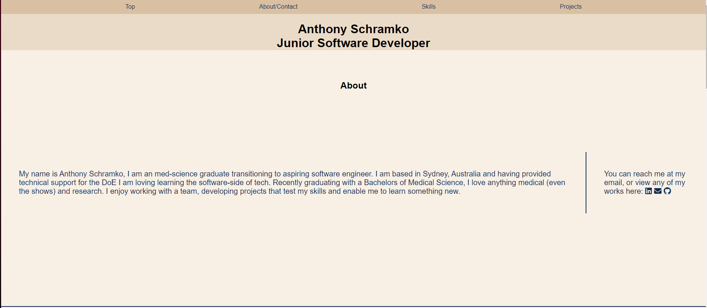
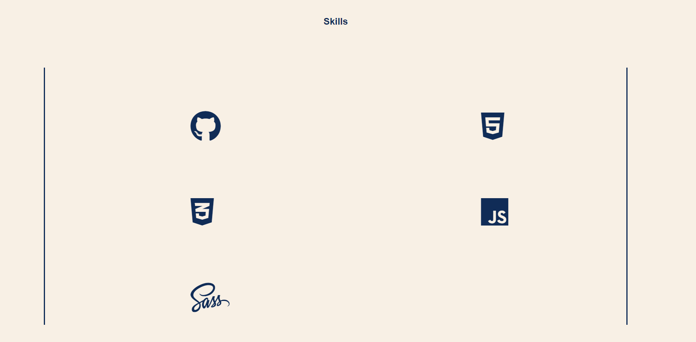
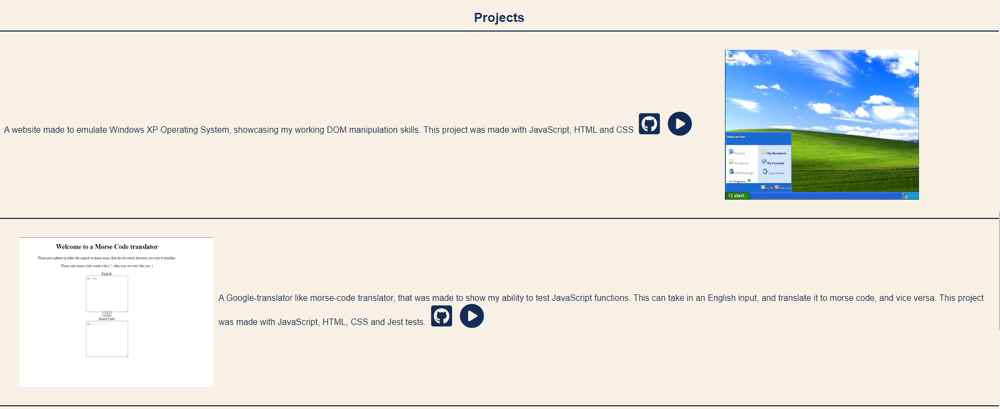

# Anthony Schramko Portfolio

## Demo & Snippets

### Landing:



### Skills:



### Projects:



## Requirements / Purpose

### Outline:

- Outline
  It is time to put what you have been learning to the test here is your project brief! Your challenge is to put everything you’ve learned so far to the test by building your own portfolio website. This website will form the foundation of your final portfolio at the end of the course, allowing you to showcase yourself and your work to its best potential. You are obviously free to iterate on the design of it as you progress through the course, but the aim for now is a high quality first draft that we can connect all your future projects to. Let’s build! We’re aiming for the following goals for this project:

### MVP's:

- You need to have it as a public repository on GitHub
- In the repo you will also need a README.md with a short intro to the project.
- You are to use SCSS for styling.
- You are to use B.E.M as a naming convention.
- !!! Responsiveness is vital – use Grid, Flex, whatever you wish but the site must look good at all screen widths. VERY CRITICAL! : You will need to make sure that your website looks good on phones, tablets and laptops
- Your Portfolio should have the following sections:

  - A landing page/section with your name and title on it.
  - An About page/section with a little about you
  - A Tech stacks/skills page/section with all the techs you have learned during the course
  - A Project page/section with all your projects (use placeholder images and text at the beginning to render your website as it would with actual projects) - each project should have a little description, a link to a live version and a link to the matching GitHub Repo (using a README.md at the root of the repo to include how you went about coding for that project)
  - A Contact page/section with your email, GitHub profile link, LinkedIn profile link

---

## Build Steps

- Use liveserver to start website
- For SASS/CSS updates:
  - ```
    sass --watch --no-source-map styles.scss styles.css
    ```

---

## Design Goals / Approach

- I broke the website up into sections, then later developed the aesthetic I wanted. This allowed me to focus on the core structure of the website, what information I wanted to show and how I wanted to do this. Later I came back and updated the SCSS/CSS. This was easier, because then I also knew the layout of the website so I could easier follow BEM.

---

## Features

- This has a few links that go to my GitHub, my email and my Linkedin.
- It has images of my projects
- Has multiple sections that can be navigated too using the navbar

---

## Known issues

- At smaller viewports, the About page has a scroll that is from an unknown origin.

---

## Future Goals

- Once I host my other projects, I would like the play button to go to those projects.

---

## Change logs

### 21/11/2023 - Updated projects section

- Changed placeholder images/links for my projects to the actual projects
- Changed the Lorem Ipsum description to an actual description.

---

## What did you struggle with?

- As this was my first larger project, just getting started was a struggle. At first it seemed like such a big issue, but in retrospect it really wasn't. I first started with the structre, making divs/sections for each section I would need. I then used SCSS/CSS to properly design the website, which took a bit longer than I would have liked since this was my first time doing something to this scale. I once again worked through each section, starting with navbar then working my way down the website. Making this project into really small pieces made it infinitely easier, as instead of "working on a full website" I was working on a section of a website. At the end, I looked at the whole website and then fixed any problems I could find.

---
